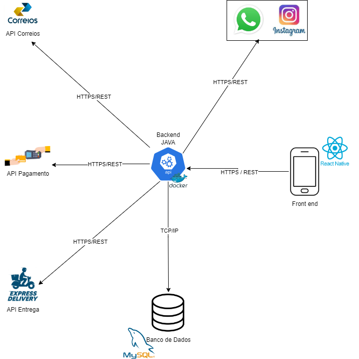
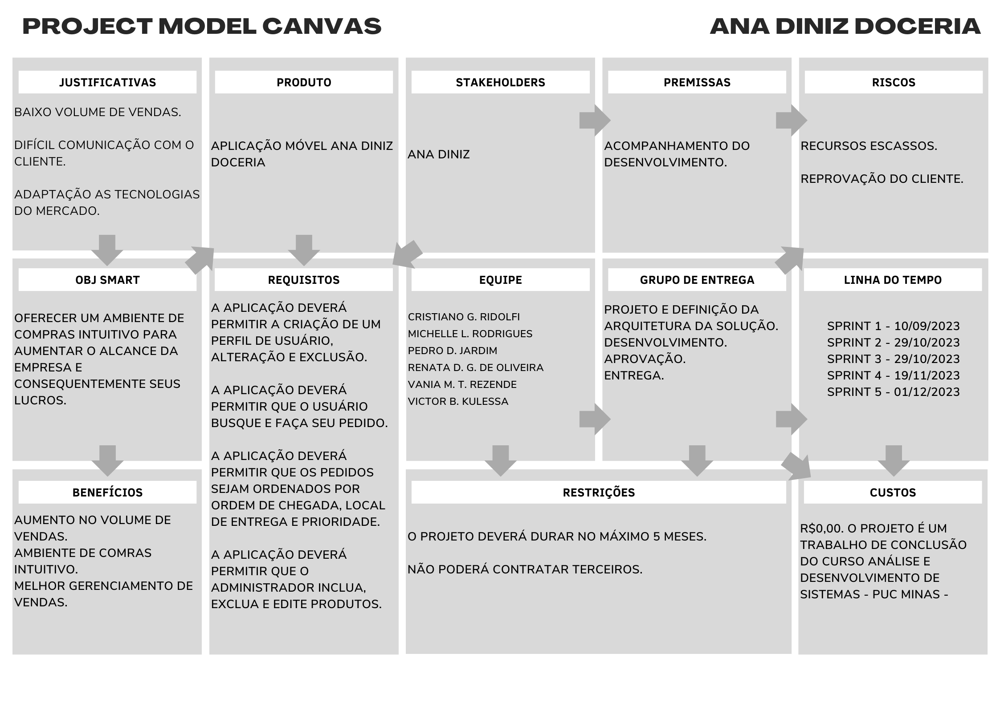
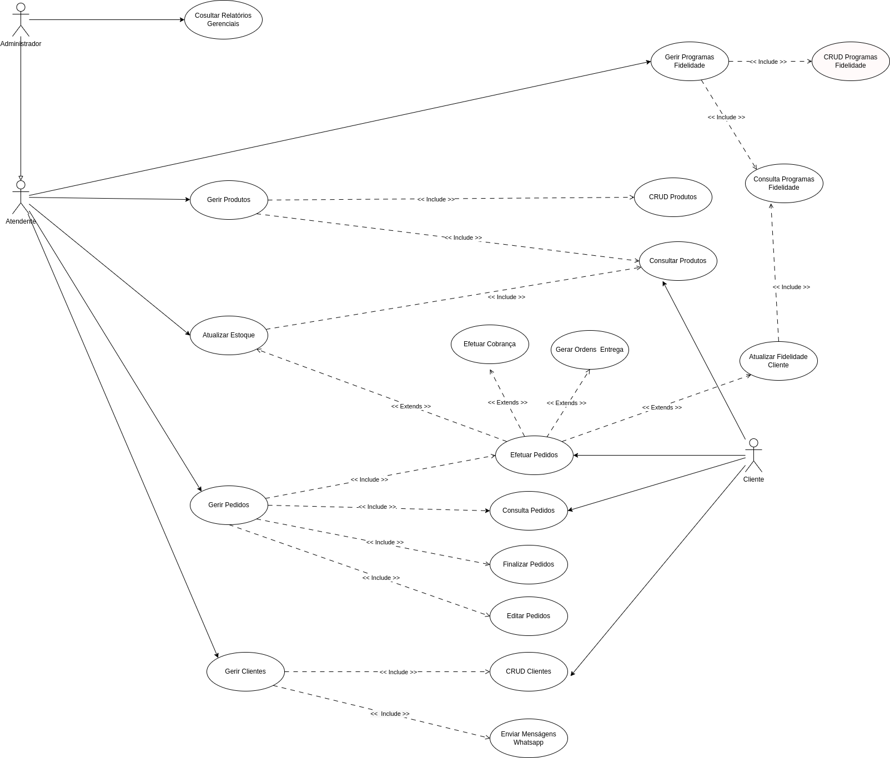
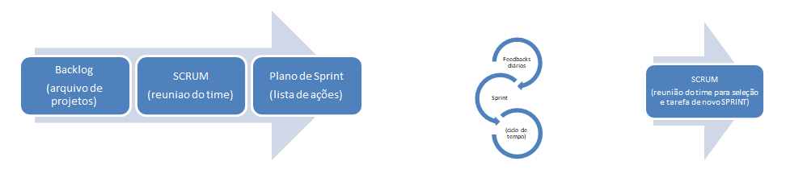

# Especificações do Projeto

## Requisitos

As tabelas que se seguem apresentam os requisitos funcionais e não funcionais que detalham o escopo do projeto. Para determinar a prioridade de requisitos, aplicar uma técnica de priorização de requisitos e detalhar como a técnica foi aplicada.

### Requisitos Funcionais

| ID     | Descrição do Requisito                                                                                          | Prioridade |
| ------ | --------------------------------------------------------------------------------------------------------------- | ---------- |
| RF-001 | A aplicação deverá permitir a criação de um perfil de usuário.                                                  | ALTA       |
| RF-002 | A aplicação deverá permitir que o administrador gerencie o relatório de compras.                                | ALTA       |
| RF-003 | A aplicação deverá permitir a alteração dos dados de usuários.                                                  | ALTA       |
| RF-004 | A aplicação deverá permitir que os pedidos sejam ordenados por ordem de chegada.                                | MÉDIA      |
| RF-005 | A aplicação deverá permitir a criação, edição, e a exclusão dos produtos.                                       | MÉDIA      |
| RF-006 | A aplicação deverá permitir a busca de produtos com a opção de filtrar sua pesquisa.                            | ALTA       |
| RF-007 | A aplicação deverá permitir a opção de salvar o produto escolhido.                                              | BAIXA      |
| RF-008 | A aplicação deverá permitir a chegada de uma mensagem via whatsapp a cada pedido efetuado.                      | ALTA       |
| RF-009 | A aplicação deverá permitir a visualização da quantidade e produtos em estoque.                                 | MÉDIA      |
| RF-010 | A aplicação deverá permitir que os usuários possam fazer pedidos.                                               | ALTA       |
| RF-011 | A aplicação deverá informar aos usuários varias formas de pagamento ( Cartão, Dinheiro, Pix ).                  | ALTA       |
| RF-012 | A aplicação deverá informar aos usuários os valores das taxas de entrega de acordo com sua localidade.          | BAIXA      |
| RF-013 | A aplicação deverá fidelizar os clientes mais frequente oferecendo benefícios e vantagens.                      | MÉDIA      |
| RF-014 | A aplicação deverá permitir que o administrador visualize a lista de clientes.                                  | MÉDIA      |
| RF-015 | A aplicação deverá permitir a exclusão de sua conta pelo usuário.                                               | ALTA       |

### Requisitos não Funcionais

| ID      | Descrição do Requisito                                                      | Prioridade |
| ------- | --------------------------------------------------------------------------- | ---------- |
| RNF-001 | A aplicação deve ser compatível com sistemas Android e iOS.                 | ALTA       |
| RNF-002 | A aplicação deve ser responsiva para rodar em diversos dispositivos.        | ALTA       |
| RNF-003 | A aplicação deve processar requisições do usuário em no máximo 11 segundos. | BAIXA      |
| RNF-004 | A aplicação deve ser implementado utilizando React Native                   | ALTA       |

# Restrições

O projeto está restrito pelos itens apresentados na tabela a seguir.

| ID  | Restrição                                                                                                 |
| --- | --------------------------------------------------------------------------------------------------------- |
| 01  | O projeto deverá ser entregue até o final do semestre letivo, não podendo extrapolar a data de 17/12/2023 |
| 02  | O projeto poderá ser construido com base nas tecnologias desenvolvidas durante os semestres anteriores.   |
| 03  | A equipe não pode subcontratar o desenvolvimento do projeto.                                              |

## Arquitetura e Tecnologias

Para atender os requisitos funcionais e não funcionais propomos a seguinte arquitetura.

# Tecnologias e Integrações

- Back End - App Java sendo executada em containers Docker.
- Front End - será desenvolvido em React Native.
- Banco de Dados - Banco de Dados Relacional MySQL.
- API de Entrega - Express Delivery para a entrega dos produtos.
- Gateway de Pagamento - em definição.
- API dos Correios - para definição do raio de CEPs atendimentos pela Ana Diniz Doceria.
- Whatsapp - para comunicação direta com o cliente.
- Instagram - para divulgação e marketing.

## Project Model Canvas

Abaixo ilustração com o quadro Project Model Canvas

## Diagrama de Casos de Uso

O diagrama abaixo ilustra as principais ligações entre casos de uso e os atores relacionados aos requisitos funcionais levantados para o projeto.

## Modelo ER (Projeto Conceitual)

O Modelo ER representa através de um diagrama como as entidades (coisas, objetos) se relacionam entre si na aplicação interativa.

## Projeto da Base de Dados

O projeto da base de dados corresponde à representação das entidades e relacionamentos identificadas no Modelo ER, no formato de tabelas, com colunas e chaves primárias/estrangeiras necessárias para representar corretamente as restrições de integridade.

### Relação de Ambientes de Trabalho
   
| Ambiente      | Plataforma                | Link de Acesso             |
|---------------|---------------------------|----------------------------|
| Repositório de Código Fonte | GitHub | https://github.com/ICEI-PUC-Minas-PMV-ADS/pmv-ads-2023-2-e5-proj-empext-t2-grupo-1-turma-2.git |
| Documentação do Projeto | GitHub | https://github.com/ICEI-PUC-Minas-PMV-ADS/pmv-ads-2023-2-e5-proj-empext-t2-grupo-1-turma-2/tree/main/docs |
| Projeto de Interface  | Canva | https://canva.com |
| Diagramas  | Draw io | https://draw.io |
| Gerenciamento do Projeto | Github | https://github.com/orgs/ICEI-PUC-Minas-PMV-ADS/projects/588/views/2 |

## Controle de Versão

A ferramenta de controle de versão escolhida para o projeto foi o Git, com o GitHub tendo sido escolhido para a hospedagem do repositório. O fluxo de trabalho do Git escolhido para o projeto foi o Gitflow (descrito em Driessen, 2010), que consiste em um modelo de organização e gerenciamento de ramificações (branches) do Git. Dentro do Gitflow, todo o desenvolvimento e manutenções no código são realizados em branches separadas, sendo elas:

     
- `main`: branch criada no início de projeto que deve conter apenas código pronto para lançamento, deve-se realizar (direta ou indiretamente) o merge de todas as outras branches à main branch quando estas houverem sido suficientemente testadas e consideradas concluídas.
- `develop`: branch criada a partir da main branch no início do projeto que contém novas funcionalidades recém produzidas, mas que ainda se encontram na fase de testes. É onde deve ser realizado o merge de novas funcionalidades desenvolvidas nas feature branches que já terminaram de ser progamadas mas ainda não foram testadas.
- `feature`: branches que devem ser criadas a partir da develop branch ao iniciar a implementação de uma nova funcionalidade. Ao completar a funcionalidade em questão, deve-se realizar o merge da feature branch em questão com a develop branch.    
- `release`: branch utilizada no processo de preparar um novo lançamento (release) do produto. É ramificada a partir da develop branch e deve ser utilizada apenas para a correção de bugs, melhoramentos em funcionalidades existentes e outras atividades relacionadas ao lançamento em questão (sem implementação de novas funcionalidades). Ao final do processo, deve ocorrer o merge desta branch com a main branch (marcando-se esta com o número da versão) e também com a develop branch.
- `hotfix`: branch ramificada diretamente da main branch que é utilizada para realizar modificações rápidas na main branch para lançamentos de produção. Uma vez concluída, deve-se realizar o merge tanto com a main branch (para implementação da modificação) quanto com a develop branch (para que as correções também estejam presentes no próximo release).
     

Tal modelo permite a correção rápida de lançamentos de produção mantendo uma linha de desenvolvimento dedicada para a atualização de segurança, deixando que a equipe trabalhe com problemas sem interromper o fluxo do trabalho ou esperar o próximo ciclo de lançamento.
     
Uma representação gráfica deste fluxo de trabalho (obtida do artigo da Atlassian encontrado na seguinte URL: https://www.atlassian.com/br/git/tutorials/comparing-workflows/gitflow-workflow) pode ser observada na figura abaixo:

 

<b>Figura </b> - Fluxo de controle do código fonte no repositório github  

 

 

A gerência de issues será feita utilizando o próprio sistema do Github dentro do repositório do projeto, adotando-se a seguinte convenção para
etiquetas:

- `documentation`: realizar mudanças na documentação
- `bug`: reportar problemas nas funcionalidades implementadas
- `enhancement`: realizar melhorias em alguma funcionalidade
- `feature`: realizar a implementação de uma nova funcionalidade

## Metodologia ágil

A equipe O Que tem pra Hoje utiliza métodos ágeis como metodologia de trabalho de acompanhamento do projeto. O método Scrum foi definido como base do processo de desenvolvimento. A equipe está organizada da seguinte maneira, conforme especificado no Project Model Canvas

A equipe trabalhará com divisões de tarefas e com encontros semanais após reunião com o P.O. para planejar e tirar dúvidas a respeito das tarefas delegadas.
Na primeira reunião de cada etapa, as tarefas serão organizadas e distribuídas.

Na segunda-feira que precede a entrega da etapa, a equipe irá se se reunir para revisar e alinhar se o que foi solicitado está pronto para ser entregue.
A Scrum Master acompanhará estas sprints (tarefas) semanalamente.

O projeto seguirá o seguinte fluxo de metodologia:

Utilizando essa metodologia, prevê-se ter uma maior produtividade, melhoria na comunicação, maior qualidade, integração entre os integrantes, respostas a imprevistos.

### Processo

Para organização e distribuição das tarefas do projeto, a equipe está utilizando o quadro Kanban no Projects, própria ferramenta do Github, 
com estrutura e desenvolvimento nas seguintes status:

**To Do:** Nessa coluna, estão alocadas as tarefas estabelecidas para a Sprint atual e que ainda não foram iniciadas, assim como os membros da equipe responsáveis por cada item.  

**In progress:** Tarefas que já foram iniciadas mas ainda não finalizadas, são acompanhadas rotineiramente seguindo os ritos da metodologia ágil. 

**Test:** Tarefas iniciadas e finalizadas, passam por validações de negócio e de lógica, assim preservando um controle de qualidade e evitando que aconteça bugs inesperados. 

**Test Return:** Coluna para sinalizar tarefas que de alguma maneira não passaram no teste de qualidade e sendo necessário um retrabalho para passar no teste de qualidade. 

**Waiting Deploy:** Quando uma tarefa tiver sido iniciada e finalizada, é movida para a coluna de waiting deploy, para que o responsável revise o código feito e aprove para as branch de teste. 

**Done:** Tarefas concluídas e aprovadas no teste de qualidade.

O quadro kanban do projeto no Github está disponível em: https://github.com/orgs/ICEI-PUC-Minas-PMV-ADS/projects/588/views/2 .

### Ferramentas

As ferramentas empregadas no projeto são:
- **Editor de Código:** O editor de código escolhido foi o _Visual Studio_ pela integração com outras ferramentas utilizadas no projeto como _GitHub_ e o _SQL Server_.
- **Ferramentas de comunicação:** A ferramenta de comunicação escolhida foi o _Microsoft Teams_ devido a facilidade de comunicação, reuniões em vídeo, compartilhamento de arquivos e a criação de um ambiente de trabalho exclusivamente focado no nosso projeto.
- **Ferramentas de desenho de tela (wireframing):** A ferramenta escolhida para a elaboração dos wireframes foi o _Canva_. A escolha se deu dado a sua capacidade de geração de wireframes interativos detalhados.
- **Ferramentas de elaboração de diagramas:** Para a elaboração dos diversos diagramas do projeto (diagramas de fluxo, diagramas de classes, modelo ER e esquema relacional), a ferramenta _Draw.io_ foi escolhida por conta de sua versatilidade para elaboração de diagramas de diversos tipos.
- **Ferramentas de controle de versão:** Conforme descrito na seção “Controle de Versão”, a ferramenta de controle de versão escolhida foi o _Git_, cuja utilização se deu através da integração com o editor de código _Visual Studio_, para a hospedagem do repositório será utilizado o _GitHub_. Essa escolha foi feita devido à robustez dessas ferramentas e a familiaridade dos membros da equipe com as elas.
- **Ferramenta de gerenciamento de projeto:** A ferramenta _Github_ foi escolhida para a organização e distribuição das tarefas seguindo o modelo Scrum, conforme descrito na subseção “Processo” da seção “Gerenciamento de Projeto”. A ferramenta foi escolhida dada sua facilidade de uso e sua compatibilidade com a metodologia Scrum, com diversos materiais disponíveis sobre sua integração com esta.
   

 

## Normas e Padrões de segurança para desenvolvimento de software

Devido a importância da informação para as empresas, ela tem se tornado gradualmente um alvo de ataques. Devido a esses ataques torna-se imprescindível a adoção de um sistema de segurança da informação confiável, para garantir a integridade da informação. Uma boa implementação de um sistema de segurança da informação irá proteger a informação de possíveis riscos e diminuir a vulnerabilidade.

Para Fontes (2017) a definição de segurança da informação é um conjunto de regras e ações que buscam proteger a informação. A segurança da informação tem como objetivo reduzir os riscos envolvidos quando há uma dependência deste recurso para o funcionamento de uma organização. Sem estes dados ou de forma incorreta, pode causar danos financeiros significativos.

Para a Associação Brasileira de Normas Técnicas (2013), a norma 27001 trata a segurança da informação consegue ser alcançada aplicando-se os controles adequados, monitorando e melhorando esses controles, quando surgir a necessidade. Então, para garantir uma boa segurança da informação dentro de uma organização deve-se identificar quais os procedimentos corretos a serem aplicados, adequando-se aos requisitos de cada organização.

A segurança da informação é um conjunto de práticas, estratégias e políticas, que visam proteger os dados para que não sejam acessados por pessoas, grupos ou setores não autorizados. Para garantir a segurança de forma adequada é necessário atender os três pilares básicos da segurança: confidencialidade, integridade e disponibilidade, além da legalidade, autenticidade, irretratabilidade.

Segundo Machado (2014), "a política de segurança prevê as bases da garantia de segurança de informação": normas, baselines, diretrizes e procedimentos; como por exemplo: termos de compromissos, identificação e autenticação de usuário, cópia de segurança, uso de antivírus, lembretes de seguança, entre outros. Estes procesos são necessários para a segurança da informação.

# Referências

ALVARENGA, Darlan. Com pandemia, comércio eletrônico tem salto em 2020 e dobra a participação no varejo brasileiro. G1, 22 fev. 2021. **Economia**. Disponível em: https://g1.globo.com/economia/noticia/2021/02/26/com-pandemia-comercio-eletronico-tem-salto-em-2020-e-dobra-participacao-no-varejo-brasileiro.ghtml. Acesso em: 18 ago. 2023.  

ASSOCIAÇÃO BRASILEIRA DE NORMAS TÉCNICAS. **NBR ISO/IEC 27001** - tecnologia da informação - técnicas de segurança - sistemas de gestão de segurança da informação - requisitos. 2. ed. Rio de Janeiro: ABNT, 2013. vi, 30 p. ISBN 9788507046080

BARROS, Ev'Ângela Batista Rodrigues de (org.).**Extensão PUC Minas**: encontros e diálogos. Belo Horizonte, MG: PUC Minas, 2018. *E-book*. ISBN 978-85-8239-074-0. Disponível em: http://bib.pucminas.br:8080/pergamumweb/vinculos/000046/00004698.pdf. Acesso em: 18 ago. 2023.

BRASIL. [Constituição (1988)]. **Constituição da República Federativa do Brasil de 1988**. Brasília, DF: Presidência da República, [2023]. Disponível em: https://www.planalto.gov.br/ccivil_03/constituicao/constituicao.htm. Acesso em: 21 ago. 2023.

BRASIL. **Lei de diretrizes e bases da educação nacional (1996)**. Brasília, DF: Presidência da República, [2023]. Disponível em: https://www.planalto.gov.br/ccivil_03/leis/l9394.htm. Acesso em: 21 ago. 2023.

CAVALCANTE, Zedequiasa Vieira; SILVA, Mauro Luis Siqueira da. A importância da revolução industrial no mundo da tecnologia. In: ENCONTRO INTERNACIONAL DE PRODUÇÃO CIENTÍFICA CESUMAR, 7., 2011, Maringá. **Anais eletrônico**. Maringá: CESUMAR, 2011. Disponível em: http://rdu.unicesumar.edu.br/handle/123456789/6395. Acesso em: 18 ago. 2023. 

ENCONTRO DE PRÓ-REITORES DE EXTENSÃO DAS UNIVERSIDADES PÚBLICAS BRASILEIRAS, 1., 1987, Brasília. **Conceito de extensão, institucionalização e financiamento**. Brasília: UNB, 1987. Disponível em: https://www.ufmg.br/proex/renex/images/documentos/1987-I-Encontro-Nacional-do-FORPROEX.pdf. Acesso em: 21 ago. 2023.

FONTES, Edison. **Segurança da informação**: o usuário faz a diferença. São Paulo: Saraiva, 2006. E-book

HARARI, Yuval Noah. **Sapiens**: uma breve história da humanidade.  4.ed. Rio Grande do Sul: L&PM, 2014. 452 p. 

INSTITUTO BRASILEIRO DE GEOGRAFIA E ESTATÍSTICA. **Pesquisa mostra que 82,7% dos domicílios brasileiros têm acesso à internet**. 2021. Disponível em: https://www.gov.br/mcom/pt-br/noticias/2021/a bril/pesquisa-mostra-que-82-7-dos-domicilios-brasileiros-tem-acesso-a-internet#:~:text=Em%202019%2C%20en tre%20as%20183,estudantes%20(75%2C8%25).. Acesso em: 18 ago. 2023. 

MACHADO, Felipe Nery Rodrigues. **Segurança da informação**: princípios e controle de ameaças. São Paulo: Érica, 2014. E-book

MOLZ, Rolf Fredi. Prefácio. In: LEDUR, Cleverson Lopes; SARAIVA, Maurício de Oliveira; FREITAS, Pedro Henrique Chagas. **Programação back end II**. Porto Algre: Sagah, 2019.

RAMOS, Roberto. **A era digital e a economia do século XXI**. 2018. Disponível em: https://www.brasildefatope.com.br/2018/09/19/artigo-or-a-era-digital-e-a-economia-do-seculo-xxi. Acesso em: 25 ago. 2021.
 
